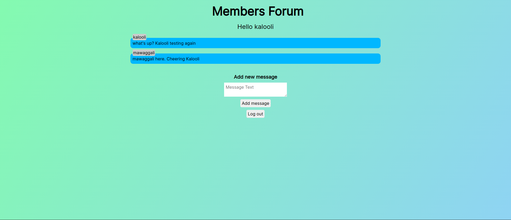
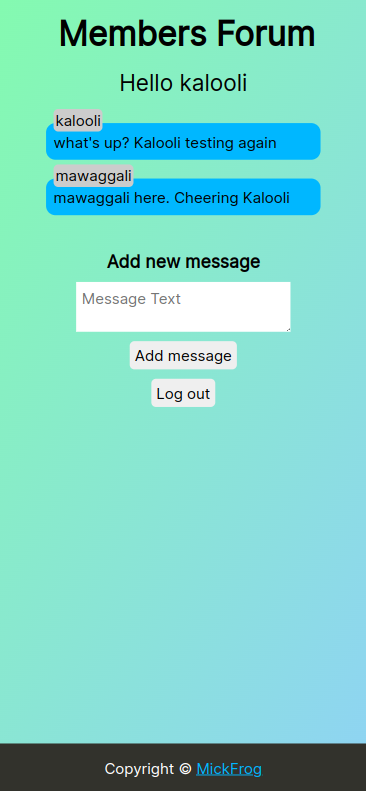

# Members Forum

This is a simple fullstack project that is similar to a chat room where users can come and add their messages.

This is a message board built on top of my previous mini-messageboard project [here](https://github.com/MickFrog/message-board)

It adds authentication to the application to allow only logged in users to send messages. Sessions are also added to the application to prevent users from having to login every time.

The live app can be checked out [here](https://members-forum-production.up.railway.app/)

## Features

1. Authentication
2. Sessions
3. Form error feedbacks
4. Responsive design
5. Messaging

## Previews

- Desktop



- Mobile



## Project Setup

1. Clone Project

```
git clone git@github.com:MickFrog/members-forum.git
cd members-forum
npm install
npm run serverstart
```

2. Set Environment Variable

- Create a .env file and add the following variable(s).

```
MONGO_KEY={your mongoDB connection string}
```

## Built with

- NodeJS
- Express.js
- Passport.js
- MongoDB
- EJS
- CSS3
